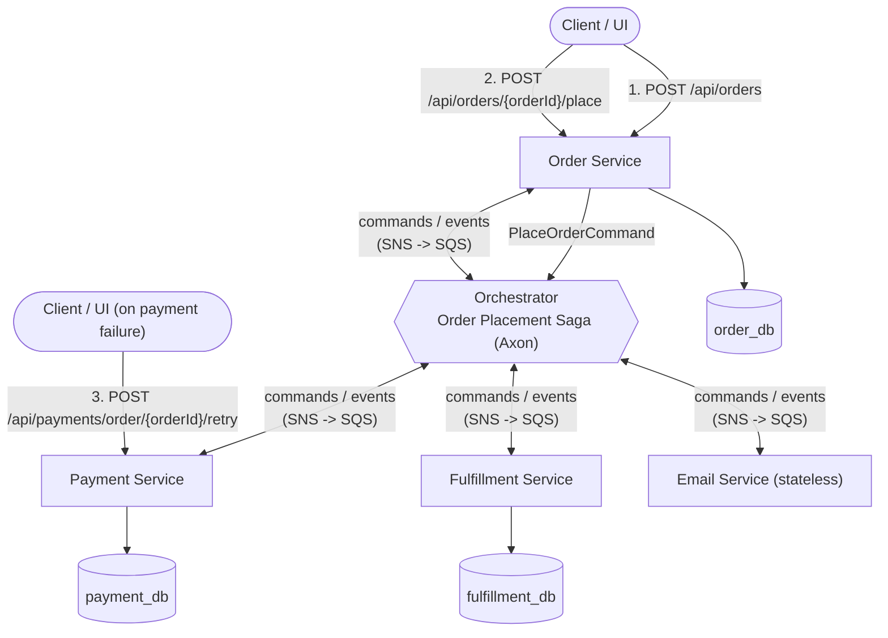
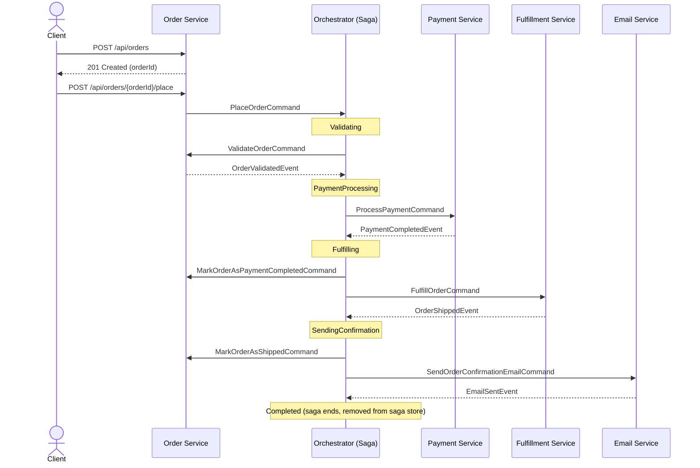
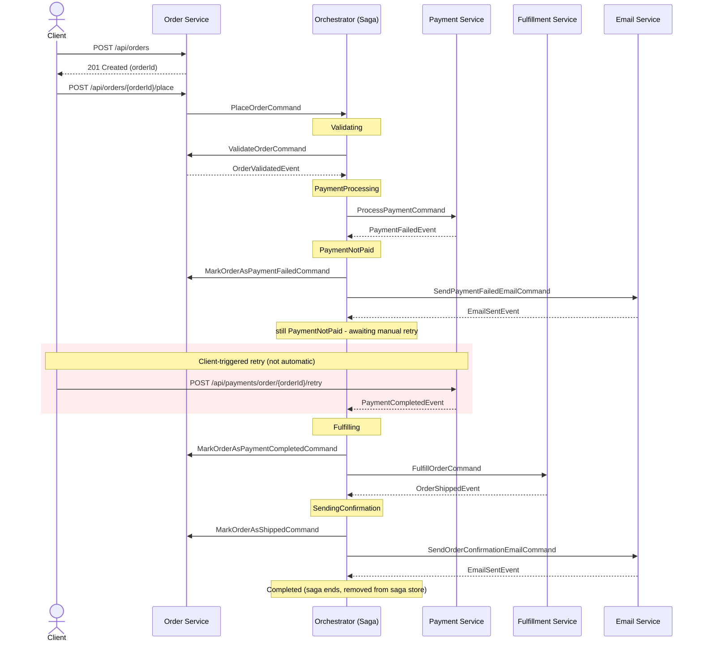

## Architecture Overview

The saga's state machine (`Validating → PaymentProcessing → Fulfilling → SendingConfirmation → Completed`,
plus retryable states `ValidationFailed`/`PaymentNotPaid` and the compensation chain
`RefundingPayment → SendingBackorderEmail → SendingRefundEmail → Cancelled`) is implemented in
`OrderPlacementSaga`. The two [Workflow Scenarios](#workflow-scenarios) below trace the exact
commands/events for the success and retry-after-payment-failure cases.

## Workflow Scenarios

Every arrow below is an async message (SNS publish → SQS deliver), not a direct call — see
[Architecture Overview](#architecture-overview). Notes mark the saga's `currentState`.

### Scenario 1: Success (happy path)

### Scenario 2: Retry with payment failed

## Features

### Saga Orchestrator Pattern
- **Centralized Workflow Management**: Single point of control for the entire order placement process
- **State Machine Implementation**: `OrderPlacementSaga` using the Axon Framework's `@Saga`/`@SagaEventHandler` model, correlated by `orderId`
- **Native Axon Saga Persistence**: Axon's own `JpaSagaStore`, autoconfigured against the `orchestrator_db` Postgres database
- **Compensating Transactions**: Automatic rollback capabilities (refunds, cancellations)
- **Queryable State**: `GET /api/sagas/orders/{orderId}` while a saga is active (completed sagas are removed from the store, matching Axon's lifecycle semantics). The orchestrator has no client-facing trigger endpoint - it is only started/retried indirectly, via the Order service publishing a `PlaceOrderCommand`.

### Technology Stack
- **Java 21**, **Maven** multi-module reactor
- **Spring Boot 3.4** (Web, Validation)
- **Axon Framework 4.10** for the saga (lifecycle/correlation/persistence) and, in every service, as the native in-JVM command/query bus (`CommandGateway`/`QueryGateway`) — cross-service dispatch still goes over SNS, not Axon's distributed CommandBus
- **Spring Cloud AWS** for SNS publish / SQS consume (against LocalStack locally)
- **PostgreSQL + Spring Data JPA** for persistence
- **Jakarta Bean Validation** for request/command validation (enforced on commands via Axon's `BeanValidationInterceptor`)

## License

MIT License - see [LICENSE](LICENSE) file for details.

## Contributing

Contributions are welcome! Please feel free to submit a Pull Request.
